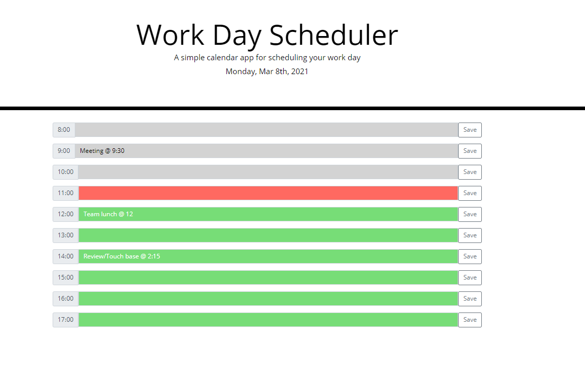

# Day Planner
This repository contains a web application made with html, css, javascript, focusing on third party APIs such as jQuery, Bootstrap, and Moment.
This day planner allows a user to save events for each hour of the day.  The planner shows the current day and timeblocks for standard business hours which is color coded by past(grey), present(red), and future(green) times. A user can enter an event in the input box and save their input to localStorage. When the user refreshes the page, the saved event persists. 

## Submission Links
Repository URL: [https://github.com/melissa-tan/day-planner](https://github.com/melissa-tan/day-planner)

Website URL: [https://melissa-tan.github.io/day-planner/](https://melissa-tan.github.io/day-planner/)

## Screenshot
The below image shows a screenshot of the planner with events.  

### Submission Requirements
- Current day is displayed at the top of the calendar
- Timeblocks for standard business hours are displayed
- Each timeblock is color coded to indicate whether it is in the past, present, or future
- When clicking on the timeblock, the user can input an event
- When clicking on the save button, the event is saved on the local storage
- When the page is refreshed, the save events persist

### Resources
Bootstrap: [https://getbootstrap.com/docs/5.0/forms/input-group/](https://getbootstrap.com/docs/5.0/forms/input-group/)  
jQuery: [https://api.jquery.com/](https://api.jquery.com/)  
Moment: [https://momentjs.com/docs/#/displaying/](https://momentjs.com/docs/#/displaying/)
